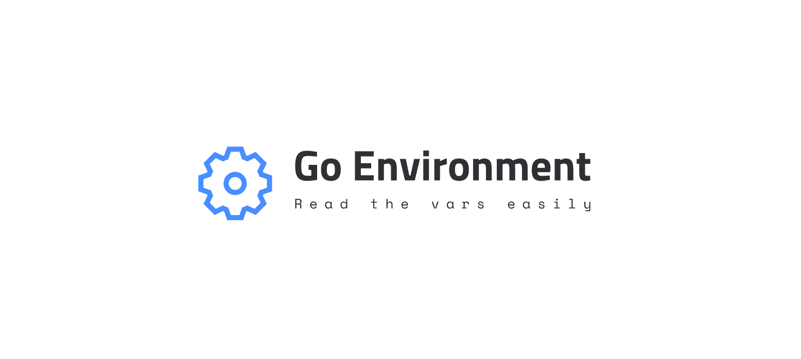

<p align="center">
  </img>
</p>

<p align="center">
    <a href="../../releases">
    <a href="LICENSE"></a>
</p>


## Latest release

[**Download**](../../releases)

## Features

* Read Environment Variables easily
* Safe read on `init`
* Fallback value support for missing/empty variables.

## Example

Suppose I want to read the environment variable `MY_INT64_VALUE` as `int64`, and if variable is not defined I want to return the value `20`. I could easily handle this with:

```go
env := Variables()
val := env.GetInt64("MY_INT64_VALUE", 20)
fmt.Println("val:", val)
// Output: 20
```

## Contributing

Everybody is welcome to contribute to the project. Please check out the [**Contribution Steps**](CONTRIBUTING.md) for instructions about how to proceed.
  
And any other comments will be very appreciate.

## License

All rights reserved to project author(s)

Redistribution and use in source and binary forms, with or without modification, are permitted provided that the following conditions are met:

 * Redistributions of source code must retain the above copyright notice, this list of conditions and the following disclaimer.
 * Redistributions in binary form must reproduce the above copyright notice, this list of conditions and the following disclaimer in the documentation and/or other materials provided with the distribution.
 * Uses GPL license described below

This program is free software: you can redistribute it and/or modify it under the terms of the GNU General Public License as published by the Free Software Foundation, either version 3 of the License, or (at your option) any later version.

See [**LICENSE**](LICENSE) file for full license details.
